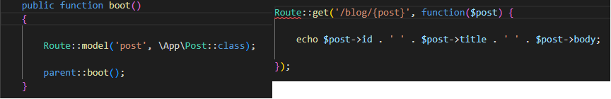

# laravel-docs
Laravel documentation for learning  
  
  
## Laravel routing  
  
  
  

### Create routes options  
  
```

Route::get('/', function(){ return 'Home Page' });     // Basic GET route
Route::get('/', 'HomeController@index')                // 5.5 version controller routes
Route::get('/', [HomeController::class, 'index']);     // Newer version controller routes

Route::get('/about', [HomeController::class, 'about'])->name('home.about') // Naming routes 

```  
  
  
### Grouping routes by middleware  
  
```

Route::group(['middlware' => 'auth'], function() {
    Route::resource('orders', 'OrdersController');
}); 

```  
  
  
### Prefix routes  
  
```

Route::group(['prefix' => 'home'], function() {
    Route::get('/', 'HomeController@index');
    Route::get('/about', 'HomeController@about');
    Route::get('/contact', 'HomeController@contact);
});

Route::group(['middlware' => 'auth', 'prefix' => 'home'], function() {
    Route::get('/', 'HomeController@index');
    Route::get('/about', 'HomeController@about');
    Route::get('/contact', 'HomeController@contact);
});

```  
  
  
### Namespacing and prefix routes  
  
```

// Http\Controller\User\RegisterController.php
// Http\Controlller\User\LoginController.php

Route::group(['prefix' => 'user', 'namespace' => 'User'], function() {
    Route::get('/passwordForgot', 'RegisterController@passwordForgot');
    Route::get('/login', 'LoginController@logout');
});

```  
  
  
### Name grouping  
  
```

Route::group(['as' => 'home.'], function() {
    Route::get('/', 'HomeController@index')->name('index');           // home.index
    Route::get('/about', 'HomeController@about')->name('about);       // home.about
    Route::get('/contact', 'HomeController@contact')->name('contact); // home.contact
});

```  
  
  
### Route with only view  
  
```

Route::view('/view', 'pages.home');

```  
  
  
### Route with regular expression parameter pattern matching  
  
```

Route::get('/user/{id}', function($id) {
  echo $id;
})->where('id', '[0-9]+');

Route::get('/user/{name}', function($name) {
  echo $name;
})->where('name', '[a-zA-Z]+');

Route::get('/user/{id}/{name}', function($id, $name) {
  echo $id;
  echo $name;
})->where('id' => '[0-9]+', 'name' => '[a-zA-Z]+');

```  
  
  
### Route model binding  
  
```

Route::get('/user/{user}', function(App\User $user) {
    echo $user->id;
    echo $user->email;
    echo $user->is_active;
});

```  
  
  
### Route model binding maped in RouteServiceProvider.php  
  

